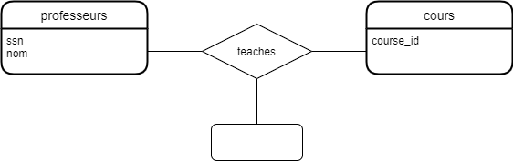
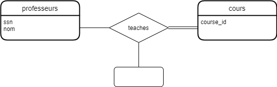
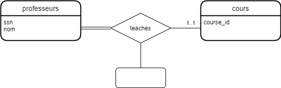
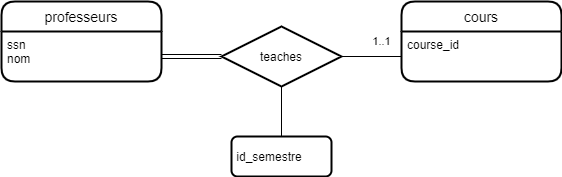
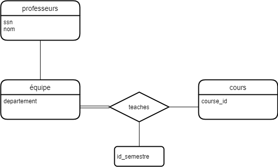
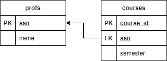
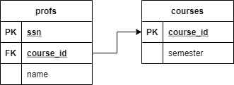
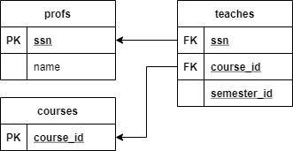
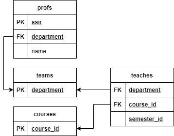

# Laboratoire 3

Laboratoire 4 ce retrouve après laboratoire 3.

## Une base de données universitaire

Une base de données universitaire contient des informations sur les professeurs
(identifié par le numéro de sécurité sociale ou SSN) et les cours
(identifié par courseid). Les professeurs donnent des cours; chacun de
les situations suivantes concernent l'ensemble de relation `teaches`.

## Diagramme ER

Pour chaque situation, modèlez un diagramme ER qui le décrit
(en supposant qu'aucune autre contrainte).  Voici un gabarit pour
votre diagramme.

1) Les professeurs peuvent enseigner le même cours sur plusieurs semestres et seule la plus récente doit être enregistrée.



2) Chaque professeur doit enseigner un cours.



3) Chaque professeur enseigne exactement un cours (ni plus, ni moins).


4) Chaque professeur enseigne exactement un cours (ni plus, ni moins), et chaque cours doit être enseigné par un professeur.



5) Les professeurs peuvent enseigner le même cours sur plusieurs semestres et chaque doit être enregistrée.



6) Supposons maintenant que certains cours puissent être enseignés conjointement par une équipe de professeurs, mais il est possible qu'aucun professeur dans une équipe ne puisse enseigner le cours. Modélisez cette situation en introduisant des ensembles d'entités et des ensembles de relations supplémentaires si nécessaire.



# Laboratoire 4
## Diagramme de relation

Note que pour ce laboratoire j'ai changer tout mes diagramme en Englais pour faciliter le code SQL et le rendre plus lisible.

Avec les diagrammes ER ci-dessus, modèlez un diagramme relationnel pour les systèmes.

1) Les professeurs peuvent enseigner le même cours sur plusieurs semestres et seule la plus récente doit être enregistrée.



3) Chaque professeur enseigne exactement un cours (ni plus, ni moins).



5) Les professeurs peuvent enseigner le même cours sur plusieurs semestres et chaque doit être enregistrée.



6) Supposons maintenant que certains cours puissent être enseignés conjointement par une équipe de professeurs, mais il est possible qu'aucun professeur dans une équipe ne puisse enseigner le cours. Modélisez cette situation en introduisant des ensembles d'entités et des ensembles de relations supplémentaires si nécessaire.



## Schèma de relation

Avec les diagrammes relationnel ci-dessus, écrivez un schéma SQL relationnel pour les systèmes.

Note: j'assume que ces commandes sont exécuter dans une base de données neuve. Donc il n'existe pas de table mais on est connecter a la base de données.

1) Les professeurs peuvent enseigner le même cours sur plusieurs semestres et seule la plus récente doit être enregistrée.

```sql
CREATE TABLE profs (
    ssn int,
    name varchar(70),
    primary key (ssn)
);

CREATE TABLE courses (
    course_id varchar(20),
    ssn int,
    semester varchar(35),
    primary key (course_id),
    constraint fk_courses_profs
        foreign key (ssn)
        REFERENCES profs (ssn)
);
```

3) Chaque professeur enseigne exactement un cours (ni plus, ni moins).

```sql
CREATE TABLE profs (
    ssn int,
    course_id varchar(20) NOT NULL,
    name varchar(70),
    primary key (ssn)
);

CREATE TABLE courses (
    course_id varchar(20),
    semester varchar(35),
    primary key (course_id)
);

ALTER TABLE profs
    ADD CONSTRAINT fk_profs_cours
        foreign key (course_id)
        REFERENCES courses (course_id);
```

5) Les professeurs peuvent enseigner le même cours sur plusieurs semestres et chaque doit être enregistrée.

```sql
CREATE TABLE profs (
    ssn int,
    name varchar(70),
    primary key (ssn)
);

CREATE TABLE courses (
    course_id varchar(20),
    primary key (course_id)
);

CREATE TABLE teaches (
    ssn int,
    course_id varchar(20),
    semester_id int,
    constraint fk_teaches_profs
        foreign key (ssn)
        REFERENCES profs (ssn),
    constraint fk_teaches_courses
        foreign key (course_id)
        REFERENCES courses (course_id)
);
```

6) Supposons maintenant que certains cours puissent être enseignés conjointement par une équipe de professeurs, mais il est possible qu'aucun professeur dans une équipe ne puisse enseigner le cours. Modélisez cette situation en introduisant des ensembles d'entités et des ensembles de relations supplémentaires si nécessaire.

```sql
CREATE TABLE teams (
    department varchar(10),
    primary key (department)
);

CREATE TABLE profs (
    ssn int,
    department varchar(10),
    name varchar(70),
    primary key (ssn),
    constraint fk_profs_teams
        foreign key (department)
        REFERENCES teams (department)
);

CREATE TABLE courses (
    course_id varchar(20),
    primary key (course_id)
);

CREATE TABLE teaches (
    department varchar(10),
    course_id varchar(20),
    semester_id int,
    constraint fk_teaches_teams
        foreign key (department)
        REFERENCES teams (department),
    constraint fk_teaches_courses
        foreign key (course_id)
        REFERENCES courses (course_id)
);
```