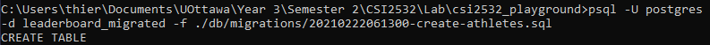
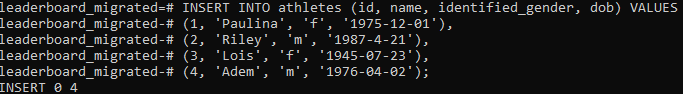
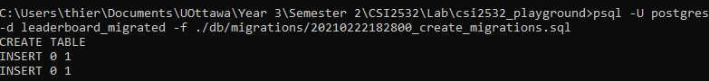
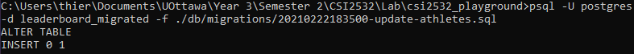
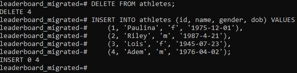
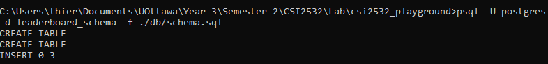
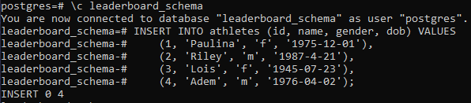
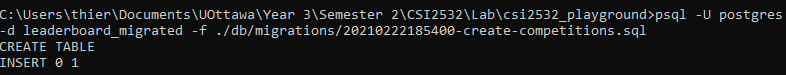

# Laboratoire 5

Thierry Laprade #300067788


## Migration: Create Athlete 
Pour commence, j'ai créer un fichier [schéma.sql](./db/schema.sql) pour correspondre au exigence du reste du laboratoire. Ensuite je n'avait qu'a copier le code dans un fichier de migration. Se fichier s'appelle [20210222181300-create-athletes.sql](./db/migrations/20210222181300-create-athletes.sql) et peut être trouver dans le fichier /db/migration.


### Schémas ([schema.sql](./db/schema.sql))
```sql
CREATE TABLE athletes (
  id int,
  name varchar(70),
  dob date,
  identified_gender CHAR(1),
  primary key (id)
);
```


### Migration ([20210222181300-create-athletes.sql](./db/migrations/20210222181300-create-athletes.sql))
```sql
CREATE TABLE athletes (
  id int,
  name varchar(70),
  dob date,
  identified_gender CHAR(1),
  primary key (id)
);
```

Voici la commande utiliser pour exécuter la migration :




### Test de Migration
Cette Migration a été tester avec cette commande d'insertion
```sql
INSERT INTO athletes (id, name, identified_gender, dob) VALUES
    (1, 'Paulina', 'f', '1975-12-01'),
    (2, 'Riley', 'm', '1987-4-21'),
    (3, 'Lois', 'f', '1945-07-23'),
    (4, 'Adem', 'm', '1976-04-02');
```
Voici la commande utiliser pour exécuter l'insertion :



On peut remarquer que la dernière ligne marque "INSERT 0 4" qui signifie que notre commande s'est bien exécuter. Donc on peut assumer que notre migration a bien fonctionner.


## Migration: Create Migrations
Ici, nous voulons créer une table pour modéliser les migrations qui on été exécuter. Donc j'ai créer un nouveau fichier nommé [20210222182800_create_migrations.sql](./db/migrations/20210222182800_create_migrations.sql). 

### Migration ([20210222182800_create_migrations.sql](./db/migrations/20210222182800_create_migrations.sql).)
```sql
CREATE TABLE schema_migrations (
    migration varchar(255),
    migrated_at time,
    PRIMARY KEY (migration)
); 

INSERT INTO schema_migrations (migration, migrated_at) VALUES 
('20210222181300-create-athletes.sql', '2021-02-22 18:13:00'); 

INSERT INTO schema_migrations (migration, migrated_at) VALUES 
('20210222182800_create_migrations.sql', '2021-02-22 18:28:00');
```

Voici la commande utiliser pour exécuter la migration :



Les trois dernière ligne de retour nous montre que la migration s'est éffectuer avec succès.


### Schémas ([schema.sql](./db/schema.sql))
Maintenant, il faut mettre a jour notre schéma original afin que ce fichier contient toujours la dernière version de notre base de donné.

```sql
CREATE TABLE athletes (
  id int,
  name varchar(70),
  dob date,
  identified_gender CHAR(1),
  primary key (id)
);

CREATE TABLE schema_migrations (
    migration varchar(255),
    migrated_at time,
    PRIMARY KEY (migration)
); 

INSERT INTO schema_migrations (migration, migrated_at) VALUES 
('20210222181300-create-athletes.sql', '2021-02-22 18:13:00'), 
('20210222182800_create_migrations.sql', '2021-02-22 18:28:00');
```


## Migration: Update Athletes
Ici, on demmande de créer une migration qui fera un "UPDATE" a la table athlete existante. Donc je commence par créer un fichier pour la nouvelle migration nommé [20210222183500-update-athletes.sql](./db/migrations/20210222183500-update-athletes.sql). 


### Migration ([20210222183500-update-athletes.sql](./db/migrations/20210222183500-update-athletes.sql))
```sql
ALTER TABLE athletes
RENAME COLUMN identified_gender TO gender;

INSERT INTO schema_migrations (migration, migrated_at) VALUES
    ('20210222183500-update-athletes.sql', '2021-02-22 18:35:00');
```

Voici la commande utiliser pour exécuter la migration :



On remarque que psql nous retourne "ALTER TABLE" et "INSERT 0 1". Ceci nous montre que la migration c'est bien exécuter.


### Test de Migration
Nous avons besoin d'exécuter certains tests afin de s'assurer que notre migration c'est bien exécuter. Voici un bloc de code SQL que j'ai utiliser pour tester ceci. Remarque que l'on n'utilise pas l'identificateur "identified_gender" mais seulement "gender".
```sql
INSERT INTO athletes (id, name, gender, dob) VALUES
    (1, 'Paulina', 'f', '1975-12-01'),
    (2, 'Riley', 'm', '1987-4-21'),
    (3, 'Lois', 'f', '1945-07-23'),
    (4, 'Adem', 'm', '1976-04-02');
```

Voici la commande exécuter sur la base de donnée:



En premier on "DELETE" tous les élément de la table et ensuite fait l'insertion. On remarque que l'insertion s'est fait avec succès en utilisant "gender" et non "identified_gender".


### Schémas ([schema.sql](./db/schema.sql))
Maintenant, il ne reste qu'a mettre a jour notre schéma original afin que ce fichier contient toujours la dernière version de notre base de donnée.
```sql
CREATE TABLE athletes (
  id int,
  name varchar(70),
  dob date,
  gender CHAR(1),
  primary key (id)
);

CREATE TABLE schema_migrations (
  migration varchar(255),
  migrated_at time,
  PRIMARY KEY (migration)
); 

INSERT INTO schema_migrations (migration, migrated_at) VALUES 
  ('20210222181300-create-athletes.sql', '2021-02-22 18:13:00'),
  ('20210222182800_create_migrations.sql', '2021-02-22 18:28:00'),
  ('20210222183500-update-athletes.sql', '2021-02-22 18:35:00');
```


### Test du Schémas
Pour tester le schémas on demande de créer une nouvelle base de donnée, de charger le schéma et d'exécuter le même test.




Donc ici, je crée une nouvelle base de donné. Ensuite je charge le schéma sur cette nouvelle base de donnée. Finalement J'exécute le test utiliser dans l'exemple précédent. On peut voir que l'insertion c'est fait avec succès. Donc notre schéma est valide et a jour.


## Migration: Create Competitions
Finalement on veut créer une table des compétitions avec une migrations. Donc il suffit de créer un nouveau fichier et d'écrire notre migration. Le fichier pour cette partie se nomme [20210222185400-create-competitions.sql](./db/migrations/20210222185400-create-competitions.sql). 

### Migration ([20210222185400-create-competitions.sql](./db/migrations/20210222185400-create-competitions.sql))
```sql
CREATE TABLE competitions (
    id int,
    name varchar(255),
    venue varchar(255),
    start_date date,
    start_time time,
    duration int,
    primary key (id)
);

INSERT INTO schema_migrations (migration, migrated_at) VALUES
    ('20210222185400-create-competitions.sql', '2021-02-22 18:54:00');
```

Voici la commande utiliser pour exécuter la migration :



On peut remarquer que la table est créer.

### Schémas ([schema.sql](./db/schema.sql))
Après que nous avons terminer notre dernière migration, notre schémas doit être mis a jour.
```sql
CREATE TABLE athletes (
  id int,
  name varchar(70),
  dob date,
  gender CHAR(1),
  primary key (id)
);

CREATE TABLE schema_migrations (
  migration varchar(255),
  migrated_at time,
  PRIMARY KEY (migration)
); 

CREATE TABLE competitions (
    id int,
    name varchar(255),
    venue varchar(255),
    start_date date,
    start_time time,
    duration int,
    primary key (id)
);

INSERT INTO schema_migrations (migration, migrated_at) VALUES 
  ('20210222181300-create-athletes.sql', '2021-02-22 18:13:00'),
  ('20210222182800_create_migrations.sql', '2021-02-22 18:28:00'),
  ('20210222183500-update-athletes.sql', '2021-02-22 18:35:00'),
  ('20210222185400-create-competitions.sql', '2021-02-22 18:54:00');
```

## Backup 
J'ai été capable de créer un backup de ma base de donné avec la commande suivante:
```
$= pg_dump leaderboard_migrated > 20210222190700_db_backup.sql
```

Ceci a automatiquement créer le fichier [20210222190700_db_backup.sql](./db/backups/20210222190700_db_backup.sql). Le fichier peut être retrouver sous /db/backups.

