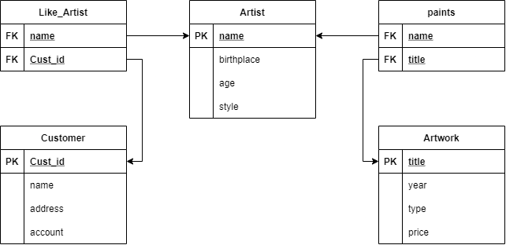

# Laboratoire 5

Thierry Laprade #300067788

NOTE : J'ai écrit le début du lab sans réaliser que je n'avait pas besoin de documenter ces requête. Clicker [ICI](#req) pour allez directement au requête demmander dans le laboratoire.

## Transformez ER en Schéma Relationnel

Voici le digramme relationnel qui correspond au diagramme ER donné dans le laboratoire.



## Créer votre base de données

Voici les list de relations de ma base de données aprés avoir créer les tables.

```bash
            List of relations
 Schema |    Name     | Type  |  Owner
--------+-------------+-------+----------
 public | artists     | table | postgres
 public | artworks    | table | postgres
 public | customers   | table | postgres
 public | likeartists | table | postgres
(4 rows)
```

## Ajoutez des données à votre base de données

Voici les données a l'interieure de chaque table après l'insertion des données :

### Customers

Requête :
```sql
SELECT * FROM customers;
```

```bash
 id | name  | address  | amount
----+-------+----------+--------
  1 | John  | Ottawa   |   8.50
  2 | Amy   | Orleans  |   9.00
  3 | Peter | Gatineau |   6.30
(3 rows)
```

### Artists

Requête :
```sql
SELECT * FROM artists;
```

```bash
    name    | birthplace |  style  | dateofbirth
------------+------------+---------+-------------
 Caravaggio | Milan      | Baroque | 1571-09-28
 Smith      | Ottawa     | Modern  | 1977-12-12
 Picasso    | Malaga     | Cubism  | 1881-10-25
(3 rows)
```

### Artworks

Requête :
```sql
SELECT * FROM artworks;
```

```bash
     title      | year |  type   |  price   | artist_name
----------------+------+---------+----------+-------------
 Blue           | 2000 | Modern  | 10000.00 | Smith
 The Cardsharps | 1594 | Baroque | 40000.00 | Caravaggio
(2 rows)
```

## List tous les artistes nés à Ottawa

Requête :
```sql
SELECT * 
FROM artists
WHERE birthplace = 'Ottawa';
```

Résultat :
```bash
 name  | birthplace | style  | dateofbirth
-------+------------+--------+-------------
 Smith | Ottawa     | Modern | 1977-12-12
(1 row)
```

## Liste des titres et des prix de toutes les ouvrages d'art en 2000

Requête :
```sql
SELECT title, price
FROM artworks
WHERE year = 2000;
```

Résultat :
```bash
 title |  price
-------+----------
 Blue  | 10000.00
(1 row)
```

## Mettre à jour le montant pour tous les clients de Gatineau a 9.8

Requête :
```sql
UPDATE customers
SET amount = 9.8
WHERE address = 'Gatineau';
```

Résultat :
```bash
UPDATE 1
```

Pour vérifier on peut exécuter une requête SELECT sur customers :

Requête :
```sql
SELECT * FROM customers;
```

Résultat :
```bash
 id | name  | address  | amount
----+-------+----------+--------
  1 | John  | Ottawa   |   8.50
  2 | Amy   | Orleans  |   9.00
  3 | Peter | Gatineau |   9.80
(3 rows)
```

On peut voir que Peter est maintenant a 9.80 (initialement a 6.30).

## Supprimer le client John

Requête :
```sql
DELETE
FROM customers
WHERE name = 'John';
```

Résultat :
```bash
DELETE 1
```

Pour vérifier on peut exécuter une requête SELECT sur customers :

Requête :
```sql
SELECT * FROM customers;
```

Résultat :
```bash
 id | name  | address  | amount
----+-------+----------+--------
  2 | Amy   | Orleans  |   9.00
  3 | Peter | Gatineau |   9.80
(2 rows)
```

On peut voir que John n'est pas dans notre base de données.

## Ajouter la colonne country à artists

Requête :
```sql
ALTER TABLE artists
ADD COLUMN country varchar(100);
```

Résultat :
```bash
ALTER TABLE
```

Pour vérifier on peut exécuter une requête \d+ sur artists :

Requête :
```sql
\d+ artists
```

Résultat :
```bash
                                            Table "public.artists"
   Column    |          Type          | Collation | Nullable | Default | Storage  | Stats target | Description
-------------+------------------------+-----------+----------+---------+----------+--------------+-------------
 name        | character varying(20)  |           | not null |         | extended |              |
 birthplace  | character varying(20)  |           |          |         | extended |              |
 style       | character varying(20)  |           |          |         | extended |              |
 dateofbirth | date                   |           |          |         | plain    |              |
 country     | character varying(100) |           |          |         | extended |              |
Indexes:
    "artists_pkey" PRIMARY KEY, btree (name)
Referenced by:
    TABLE "artworks" CONSTRAINT "artworks_artist_name_fkey" FOREIGN KEY (artist_name) REFERENCES artists(name)
    TABLE "likeartists" CONSTRAINT "likeartists_artist_name_fkey" FOREIGN KEY (artist_name) REFERENCES artists(name)
Access method: heap
```

On remarque que nous avons une nouvelle colonne nommé country.

## Ajouter une colonne Rating à customers, avec contrainte


Requête :
```sql
ALTER TABLE customers
ADD COLUMN rating integer 
CHECK (rating between 1 and 10);
```

Résultat :
```bash
ALTER TABLE
```

Pour vérifier on peut exécuter une requête \d+ sur customers :

Requête :
```sql
\d+ artists
```

Résultat :
```bash
                                         Table "public.customers"
 Column  |         Type          | Collation | Nullable | Default | Storage  | Stats target | Description
---------+-----------------------+-----------+----------+---------+----------+--------------+-------------
 id      | integer               |           | not null |         | plain    |              |
 name    | character varying(20) |           |          |         | extended |              |
 address | character varying(20) |           |          |         | extended |              |
 amount  | numeric(8,2)          |           |          |         | main     |              |
 rating  | integer               |           |          |         | plain    |              |
Indexes:
    "customers_pkey" PRIMARY KEY, btree (id)
Check constraints:
    "customers_rating_check" CHECK (rating >= 1 AND rating <= 10)
Referenced by:
    TABLE "likeartists" CONSTRAINT "likeartists_customer_id_fkey" FOREIGN KEY (customer_id) REFERENCES customers(id)
Access method: heap
```

L'important ici est notre nouvelle table et la nouvelle "Check constraints" nommé "customers_rating_check" qui s'assure que rating est entre 1 et 10.

## Ajoutez (Encore) des données à votre base de données

Noté que j'ai modifier la commande d'insertion pour les artistes puiqu'elle avait des erreures dans les date.

Nouvelle requête :

```sql
INSERT INTO artists 
(name, birthplace, style, dateofbirth, country)
VALUES
('Leonardo', 'Florence', 'Renaissance', '1452-04-15', 'Italy'),
('Michelangelo', 'Arezzo', 'Renaissance', '1475-03-06', 'Italy'),
('Josefa', 'Seville', 'Baroque', '1630-09-09', 'Spain'),
('Hans Hofmann', 'Weisenburg', 'Modern', '1966-02-17', 'Germany'),
('John', 'San Francisco', 'Modern', '1920-02-17', 'USA');
```

Voici les données a l'interieure de chaque table après l'insertion des nouvelles données :

### Customers

Requête :
```sql
SELECT * FROM customers;
```

```bash
 id | name  | address  |  amount  | rating
----+-------+----------+----------+--------
  2 | Amy   | Orleans  |     9.00 |
  3 | Peter | Gatineau |     9.80 |
  4 | Emre  | Preston  | 20000.00 |      5
  5 | Saeid |          | 40000.00 |      6
(4 rows)
```

### Artists

Requête :
```sql
SELECT * FROM artists;
```

```bash
     name     |  birthplace   |    style    | dateofbirth | country
--------------+---------------+-------------+-------------+---------
 Caravaggio   | Milan         | Baroque     | 1571-09-28  |
 Smith        | Ottawa        | Modern      | 1977-12-12  |
 Picasso      | Malaga        | Cubism      | 1881-10-25  |
 Leonardo     | Florence      | Renaissance | 1452-04-15  | Italy
 Michelangelo | Arezzo        | Renaissance | 1475-03-06  | Italy
 Josefa       | Seville       | Baroque     | 1630-09-09  | Spain
 Hans Hofmann | Weisenburg    | Modern      | 1966-02-17  | Germany
 John         | San Francisco | Modern      | 1920-02-17  | USA
(8 rows)
```

### Artworks

Requête :
```sql
SELECT * FROM artworks;
```

```bash
      title      | year |  type   |  price   | artist_name
-----------------+------+---------+----------+-------------
 Blue            | 2000 | Modern  | 10000.00 | Smith
 The Cardsharps  | 1594 | Baroque | 40000.00 | Caravaggio
 Waves           | 2000 |         |  4000.00 | Smith
 Three Musicians | 1921 | Modern  | 11000.00 | Picasso
(4 rows)
```

## Supprimez l'artiste Smith

J'ai débuter par créer un backup avec pg_dump :

```bash
pg_dump lab6 > backup-20210308184100.sql
```

Ce ficher se retrouve a [./db/backups/backup-20210308184100.sql](./db/backups/backup-20210308184100.sql)

Je pourez ensuite loader le backup avec la commande suivante :

```bash
psql lab6 < backup-20210308184100.sql
```

### Manuelle Delete

Requête :
```sql
DELETE 
FROM artworks 
WHERE artist_name = 'Smith';

DELETE 
FROM artists 
WHERE name = 'Smith';
```

Résultats :
```bash
SELECT * From artists;

     name     |  birthplace   |    style    | dateofbirth | country
--------------+---------------+-------------+-------------+---------
 Caravaggio   | Milan         | Baroque     | 1571-09-28  |
 Picasso      | Malaga        | Cubism      | 1881-10-25  |
 Leonardo     | Florence      | Renaissance | 1452-04-15  | Italy
 Michelangelo | Arezzo        | Renaissance | 1475-03-06  | Italy
 Josefa       | Seville       | Baroque     | 1630-09-09  | Spain
 Hans Hofmann | Weisenburg    | Modern      | 1966-02-17  | Germany
 John         | San Francisco | Modern      | 1920-02-17  | USA
(7 rows)

SELECT * From artworks;

      title      | year |  type   |  price   | artist_name
-----------------+------+---------+----------+-------------
 The Cardsharps  | 1594 | Baroque | 40000.00 | Caravaggio
 Three Musicians | 1921 | Modern  | 11000.00 | Picasso
(2 rows)
```

### On Cascade

Requête :
```sql
BEGIN;

ALTER TABLE artworks
DROP CONSTRAINT artworks_artist_name_fkey;

ALTER TABLE artworks
ADD CONSTRAINT artworks_artist_name_fkey 
FOREIGN KEY (artist_name) REFERENCES artists(name) 
ON DELETE CASCADE
ON UPDATE CASCADE;

COMMIT;
```

Ensuite, on peut exécuter un delete et psql s'occupe du reste :

```sql 
DELETE
FROM artists
WHERE name = 'Smith';
```

Résultats :
```bash
SELECT * From artists;

     name     |  birthplace   |    style    | dateofbirth | country
--------------+---------------+-------------+-------------+---------
 Caravaggio   | Milan         | Baroque     | 1571-09-28  |
 Picasso      | Malaga        | Cubism      | 1881-10-25  |
 Leonardo     | Florence      | Renaissance | 1452-04-15  | Italy
 Michelangelo | Arezzo        | Renaissance | 1475-03-06  | Italy
 Josefa       | Seville       | Baroque     | 1630-09-09  | Spain
 Hans Hofmann | Weisenburg    | Modern      | 1966-02-17  | Germany
 John         | San Francisco | Modern      | 1920-02-17  | USA
(7 rows)
```

## Schéma et Seed

Noté que j'ai garder le customer John et l'artiste Smith pour les exemples.

[Schéma](./db/schema.sql) :

```sql
CREATE TABLE artists (
  name VARCHAR(20),
  birthplace VARCHAR(20),
  style VARCHAR(20),
  dateofbirth DATE,
  country varchar(100),
  PRIMARY KEY (name)
);

CREATE TABLE customers (
  id INTEGER,
  name VARCHAR(20),
  address VARCHAR(20),
  amount numeric(8,2),
  rating integer CHECK (rating between 1 and 10),
  PRIMARY KEY (id)
);

CREATE TABLE artworks (
  title VARCHAR(20),
  year INTEGER,
  type VARCHAR(20),
  price numeric(8,2),
  artist_name VARCHAR(20),
  PRIMARY KEY (title),
  FOREIGN KEY(artist_name) REFERENCES artists(name)
);

CREATE TABLE likeartists (
  customer_id INTEGER,
  artist_name VARCHAR(20),
  PRIMARY KEY(artist_name, customer_id),
  FOREIGN KEY (artist_name) REFERENCES artists(name),
  FOREIGN KEY (customer_id) REFERENCES customers(id)
);
```

[Seed](./db/seed.sql) :

```sql
INSERT INTO customers (id, name, address, amount, rating)
VALUES
  (1, 'John', 'Ottawa', 8.5),
  (2, 'Amy', 'Orleans', 9.0, NULL),
  (3, 'Peter', 'Gatineau', 9.8, NULL),
  (4, 'Emre', 'Preston', 20000.00, 5),
  (5, 'Saeid', null, 40000.00, 6);

INSERT INTO artists (name, birthplace, style, dateofbirth, country)
VALUES
  ('Caravaggio', 'Milan', 'Baroque', '1571-09-28', NULL),
  ('Smith', 'Ottawa', 'Modern', '1977-12-12', NULL),
  ('Picasso', 'Malaga', 'Cubism', '1881-10-25', NULL),
  ('Leonardo', 'Florence', 'Renaissance', '1452-04-15', 'Italy'),
  ('Michelangelo', 'Arezzo', 'Renaissance', '1475-03-06', 'Italy'),
  ('Josefa', 'Seville', 'Baroque', '1630-09-09', 'Spain'),
  ('Hans Hofmann', 'Weisenburg', 'Modern', '1966-02-17', 'Germany'),
  ('John', 'San Francisco', 'Modern', '1920-02-17', 'USA');

INSERT INTO artworks (title, year, type, price, artist_name)
VALUES
  ('Blue', 2000, 'Modern', 10000.00, 'Smith'),
  ('The Cardsharps', 1594, 'Baroque', 40000.00, 'Caravaggio'),
  ('Waves', 2000, null, 4000.00, 'Smith'),
  ('Three Musicians', 1921, 'Modern', 11000.00, 'Picasso');

INSERT INTO likeartists (customer_id, artist_name)
VALUES
  (4, 'Picasso'),
  (5, 'Picasso'),
  (5, 'Leonardo');
```

La création de la base de données peut être fait avec ces commande suivante :

```bash
psql -d lab6 -f ./db/schema.sql
psql -d lab6 -f ./db/seed.sql
```

## Requête SQL 

### 1

Lister les name et birthplace de tous les artists

Requête :
```sql
SELECT name, birthplace
FROM artists;
```

Résultats :
```bash
     name     |  birthplace
--------------+---------------
 Caravaggio   | Milan
 Smith        | Ottawa
 Picasso      | Malaga
 Leonardo     | Florence
 Michelangelo | Arezzo
 Josefa       | Seville
 Hans Hofmann | Weisenburg
 John         | San Francisco
(8 rows)
```

### 2

Lister le title et le price de toutes les artworks après 1600.

Requête :
```sql
SELECT title, price
FROM artworks
WHERE year > 1600;
```

Résultats :
```bash
      title      |  price
-----------------+----------
 Blue            | 10000.00
 Waves           |  4000.00
 Three Musicians | 11000.00
(3 rows)
```

### 3

Lister le title et le type de toutes les artworks qui ont été peintes en 2000 ou peintes par Picasso.

Requête :
```sql
SELECT title, type
FROM artworks
WHERE year = 2000 
  OR artist_name = 'Picasso';
```

Résultats :
```bash
      title      |  type
-----------------+--------
 Blue            | Modern
 Waves           |
 Three Musicians | Modern
(3 rows)
```

### 4

Lister les name et birthplace de tous les artists nés entre 1880 et 1930. (ASTUCE: EXTRACT(YEAR FROM dateofbirth) vous donne l'année à partir d'un attribut DATE).

Requête :
```sql
SELECT name, birthplace
FROM artists
WHERE EXTRACT(YEAR FROM dateofbirth) between 1880 and 1930;
```

Résultats :
```bash
  name   |  birthplace
---------+---------------
 Picasso | Malaga
 John    | San Francisco
(2 rows)
```

### 5

Lister les name et le country de naissance de tous les artists dont le style de peinture est Modern, Baroque or Renaissance. (ASTUCE: utilisez le mot-clé IN).

Requête :
```sql
SELECT name, country
FROM artists
WHERE artists.style IN ('Modern', 'Baroque', 'Renaissance');
```

Résultats :
```bash
     name     | country
--------------+---------
 Caravaggio   |
 Smith        |
 Leonardo     | Italy
 Michelangelo | Italy
 Josefa       | Spain
 Hans Hofmann | Germany
 John         | USA
(7 rows)
```

### 6

Lister tous les détails des artworks dans la base de données, triés par title.

Requête :
```sql
SELECT * 
FROM artworks
ORDER BY title ASC;
```

Résultats :
```bash
      title      | year |  type   |  price   | artist_name
-----------------+------+---------+----------+-------------
 Blue            | 2000 | Modern  | 10000.00 | Smith
 The Cardsharps  | 1594 | Baroque | 40000.00 | Caravaggio
 Three Musicians | 1921 | Modern  | 11000.00 | Picasso
 Waves           | 2000 |         |  4000.00 | Smith
(4 rows)
```

### 7

Lister les name et les customer ids de tous les customers qui aiment Picasso.

Requête :
```sql
SELECT customers.name, customers.id
FROM likeartists
LEFT JOIN customers
ON likeartists.customer_id = customers.id
WHERE likeartists.artist_name = 'Picasso';
```

Résultats :
```bash
 name  | id
-------+----
 Emre  |  4
 Saeid |  5
```

### 8

Lister les name de tous les customers qui aiment les artistes de style Renaissance et dont le price est supérieur à 30000.

Note : je ne suis pas 100% sur de cette énoncé, on mentionne "le price est supérieur à 30000". Dans cette base de données, le seul mention de price est dans la table artwork. Cependant ceci ne fait pas de sense avec l'énoncé. **Donc j'assume que "le price est supérieur à 30000" veut dire "le amount du customer est supérieur à 30000".**

Requête :
```sql
SELECT customers.name
FROM likeartists
LEFT JOIN customers
ON likeartists.customer_id = customers.id
LEFT JOIN artists
ON likeartists.artist_name = artists.name
WHERE artists.style = 'Renaissance'
  AND customers.amount > 30000;
```

Résultats :
```bash
 name
-------
 Saeid
(1 row)
```


TODO REMOVE 

```sql

```
