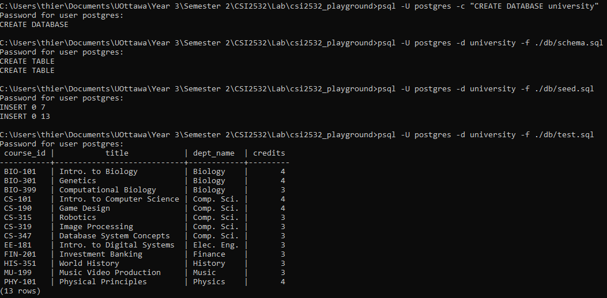

# Laboratoire
### Environement de programmation pour les laboratoires du cours CSI2532

Thierry Laprade #300067788

## Laboratoire 1 
### Objectif
- [x] Création du README.md
- [x] Partager le Repo avec le TA

## Laboratoire 2
- [x] Création de l'environement locale de programmation
- [x] Exécter des commande SQL

Voici un image de mon commande line comme preuve que mon environement postgres/SQL fonctionne:

