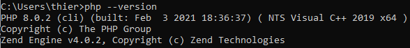
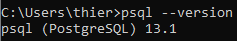
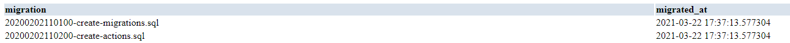

# Laboratoire 8

Thierry Laprade #300067788

Le code principale pour le projet ce retrouve dans le fichier [./lab8/php-master](./lab8/php-master). Cependant tous le code pour les étapes est inclue dans ce fichier README 
## Exercice 1 : Configurer PHPAPP

Version PHP :



Version PSQL :



Application : 



## Exercice 2 : Créer un client

CREATE clients :
```sql
CREATE TABLE clients (
    name varchar(70),
    token varchar(32) DEFAULT md5(random()::text),
    data jsonb
);
```

INSERT clients :
```sql
INSERT INTO clients (name, data) VALUES 
    ('Big Co.', '{"rank": 1}'),
    ('Small Co.', '{"rank": 2}');
```

Si j'exécute la commande suivante, on poura voir quelle token ont été automatiquement générer pour les clients, Ceci sera utile plus tard pour l'authorisation:
```sql
SELECT name, token
FROM clients;
```

Réponse :

| name | token |
| ---- | ----- |
| Big Co. | 5ad9f58bcfd9e5526514b45da4a56690 |
| Small Co. | 4d2fe69a89f8d2e9572757fdf709cf9d |

Note : si la même commande est exécuter sur un différent ordinateur, vous obtiendrer des résultat différent

## Exercice 3 : Créer une API

```php
<?php
$all = getallheaders();
header("Content-Type: application/json");

if (isset($all["X-Men"])) {

    $mutant = $all["X-Men"];

    //https://en.wikipedia.org/wiki/List_of_X-Men_members
    switch ($mutant) {
        case "Wolverine":
            $name = "Logan";
            break;
        case "Professor X":
            $name = "Charles Francis Xavier";
            break;
        case "Cyclops":
            $name = "Scott Summers";
            break;
        case "Iceman":
            $name = "Robert Louis Drake";
            break;
        case "Beast":
            $name = "Henry Philip McCoy";
            break;
        case "Phoenix":
            $name = "Jean Elaine Grey";
            break;
        default:
            $name = "Unknown";
    }
    $reply = ["mutant" => $mutant, "name" => $name];
} else {
    $reply = ["error" => "Invalid Request.", "headers" => $all];
    http_response_code(400);
}
echo json_encode($reply);
```

## Exercice 4 : Authentifiez votre API

```php
<?php
$all = getallheaders();
header("Content-Type: application/json");

if (isset($all["X-Men"]) && isset($all["Authentication"])) {

    $auth = explode(" ", $all["Authentication"]);

    if (isset($all["X-Men"]) && $auth[1] != "professorcharlesxavier") {
        $reply = ["error" => "Invalid token.", "type" => $auth[0], "token" => $auth[1]];
        http_response_code(401);
    } else {

        $mutant = $all["X-Men"];

        //https://en.wikipedia.org/wiki/List_of_X-Men_members
        switch ($mutant) {
            case "Wolverine":
                $name = "Logan";
                break;
            case "Professor X":
                $name = "Charles Francis Xavier";
                break;
            case "Cyclops":
                $name = "Scott Summers";
                break;
            case "Iceman":
                $name = "Robert Louis Drake";
                break;
            case "Beast":
                $name = "Henry Philip McCoy";
                break;
            case "Phoenix":
                $name = "Jean Elaine Grey";
                break;
            default:
                $name = "Unknown";
        }
        $reply = ["mutant" => $mutant, "name" => $name];
    }
} else {
    $reply = ["error" => "Invalid Request.", "headers" => $all];
    http_response_code(400);
}
echo json_encode($reply);
```

## Exercice 5 : Jetons client

```php
<?php

$dbconn = pg_connect("host=localhost port=5432 dbname=phpapp");
$result = pg_query($dbconn, "SELECT token FROM clients");
$data = pg_fetch_all($result);

$all = getallheaders();
header("Content-Type: application/json");

if (isset($all["X-Men"]) && isset($all["Authentication"])) {

    $auth = explode(" ", $all["Authentication"]);

    $found = false;

    foreach($data as $client) {
        if ($client["token"] == $auth[1]) {
            $found = true;
        }
    }

    if (!$found) {
        $reply = ["error" => "Invalid token.", "type" => $auth[0], "token" => $auth[1]];
        http_response_code(401);
    } else {

        $mutant = $all["X-Men"];

        //https://en.wikipedia.org/wiki/List_of_X-Men_members
        switch ($mutant) {
            case "Wolverine":
                $name = "Logan";
                break;
            case "Professor X":
                $name = "Charles Francis Xavier";
                break;
            case "Cyclops":
                $name = "Scott Summers";
                break;
            case "Iceman":
                $name = "Robert Louis Drake";
                break;
            case "Beast":
                $name = "Henry Philip McCoy";
                break;
            case "Phoenix":
                $name = "Jean Elaine Grey";
                break;
            default:
                $name = "Unknown";
        }
        $reply = ["mutant" => $mutant, "name" => $name];
    }
} else {
    $reply = ["error" => "Invalid Request.", "headers" => $all];
    http_response_code(400);
}
echo json_encode($reply);
```